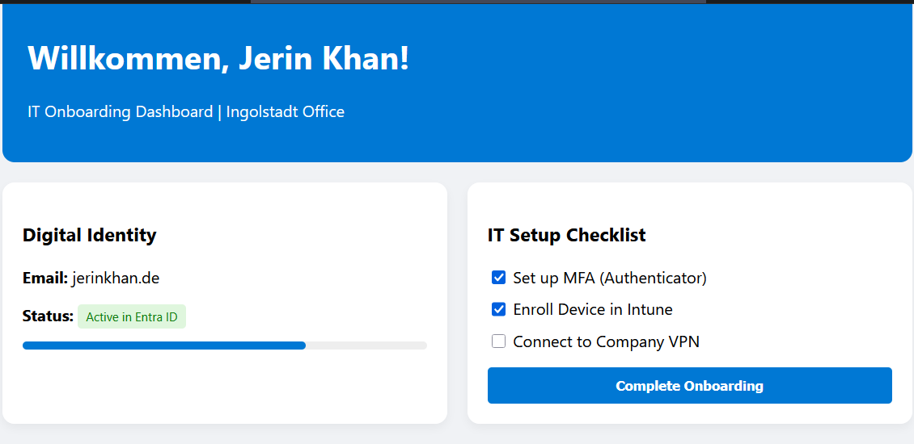

# 🚀 IT Onboarding Portal
A functional web application built to demonstrate **Frontend Development** skills and **IT Operations** knowledge.

## ✨ Features
- **Interactive Onboarding:** Users can complete setup tasks.
- **Dynamic UI:** The dashboard updates visually upon completion using Vanilla JS.
- **IT Concepts:** Includes MFA setup, Intune enrollment, and VPN configuration.

## 🛠️ Tech Stack
- HTML5 & CSS3
- Vanilla JavaScript (DOM Manipulation)

## 📸 Project Preview

| Initial State | Completed Onboarding |
| ------------- | -------------------- |
|  |  |
